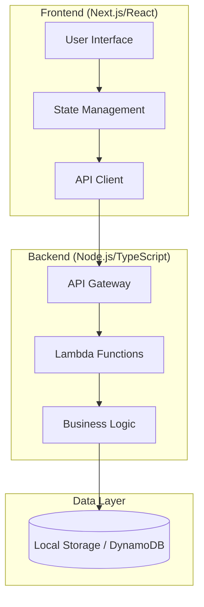

# Design Document: Task Management System

## Overview

El Task Management System es una aplicación web completa que permite a los usuarios gestionar tareas con diferentes prioridades. La arquitectura sigue los principios serverless-first de NexusCorp, utilizando React/Next.js para el frontend y Node.js/TypeScript para el backend, preparado para despliegue en AWS Lambda.

**Diseño Visual:** Basado en el diseño de Figma:
- **URL:** https://www.figma.com/design/p6DkcwhGo9RasbGJAsR2cX/Personal-Task-Manager-In-Figma--Community-?node-id=0-1&p=f&t=7wM3c0Od4hn5B5gp-0
- **File Key:** p6DkcwhGo9RasbGJAsR2cX
- **Main Node:** 0:1 (Task Manager canvas)
- **Task List Node:** 3:78 (List component)

El diseño muestra una lista de tareas con:
- Fondo gris claro (#f3f5f7) con borde blanco
- Tarjetas de tareas blancas con bordes redondeados
- Iconos de 50x50px a la izquierda del título
- Información de fecha, categoría y prioridad a la derecha
- Sistema de colores para prioridades (rojo=alta, amarillo=media, verde=baja)
- Etiquetas de categoría (azul=personal, dorado=trabajo)

La aplicación implementa una arquitectura de tres capas:
- **Presentation Layer**: Frontend React/Next.js con TypeScript
- **Business Logic Layer**: Funciones puras e inmutables para lógica de dominio
- **Data Layer**: API REST con persistencia (inicialmente local, preparada para DynamoDB)

## Architecture

### High-Level Architecture



### Technology Stack

**Frontend:**
- Next.js 14+ con TypeScript
- React 18+ con hooks
- Material-UI para componentes consistentes
- Axios para llamadas HTTP
- React Query para cache y sincronización

**Backend:**
- Node.js 18+ con TypeScript
- Express.js para desarrollo local
- AWS Lambda para producción
- Joi para validación de datos
- UUID para generación de IDs

**Development:**
- Jest para testing unitario
- Supertest para testing de API
- ESLint + Prettier para calidad de código
- Husky para pre-commit hooks

## Components and Interfaces

### Core Domain Types

```typescript
// Domain Types
interface Task {
  id: string;
  titulo: string;
  estado: 'pendiente' | 'completada';
  prioridad: Priority;
  fechaCreacion: Date;
}

type Priority = 'alta' | 'media' | 'baja';

interface TaskStats {
  total: number;
  completadas: number;
  pendientes: number;
}

// API Response Types
interface ApiResponse<T> {
  statusCode: number;
  data: T;
}

interface ApiError {
  statusCode: number;
  error: {
    message: string;
    code: string;
  };
}
```

### Frontend Components

**1. TaskApp (Main Container)**
- Manages global application state
- Handles API integration
- Coordinates child components

**2. TaskForm**
- Input form for creating new tasks
- Real-time validation
- Priority selection

**3. TaskList (Based on Figma "List" component)**
- Container: 1040x960px with light gray background (#f3f5f7)
- White border (3px) with 12px border radius
- 20px padding with 10px gap between tasks
- Displays filtered task list
- Handles task completion toggle
- Responsive design

**4. TaskCard (Based on Figma "Task" component)**
- White background with 6px border radius
- Fixed dimensions: 1000x83px
- Layout: Flexbox with justify-between
- Left section: Icon (50x50px) + Title (540px width)
- Right section: Due date + Category tag + Priority icon (20x20px)
- Typography: IBM Plex Sans Medium, 18px

**5. TaskFilters**
- Filter buttons (All, Pending, Completed)
- Active filter state management

**6. TaskStats**
- Displays calculated statistics
- Real-time updates

**7. CategoryTag (Based on Figma design)**
- Personal: Blue background (#1e6bd6)
- Trabajo: Brown/gold background (#c3b573)
- White text, 10px padding, 6px border radius

**8. PriorityIcon (Based on Figma design)**
- Alta (High): Red circle (#fb1856)
- Media (Medium): Yellow circle (#f2d023)
- Baja (Low): Green circle (#259d6e)
- Size: 20x20px

### Backend API Endpoints

```typescript
// API Interface
interface TaskAPI {
  // GET /api/tasks?filter=all|pendientes|completadas
  getTasks(filter?: TaskFilter): Promise<ApiResponse<Task[]>>;
  
  // POST /api/tasks
  createTask(taskData: CreateTaskRequest): Promise<ApiResponse<Task>>;
  
  // PUT /api/tasks/:id/toggle
  toggleTaskCompletion(id: string): Promise<ApiResponse<Task>>;
  
  // GET /api/tasks/stats
  getTaskStats(): Promise<ApiResponse<TaskStats>>;
}

interface CreateTaskRequest {
  titulo: string;
  prioridad: Priority;
}

type TaskFilter = 'all' | 'pendientes' | 'completadas';
```

### Business Logic Functions

```typescript
// Pure Domain Functions
interface TaskDomain {
  createTask(titulo: string, prioridad: Priority): Task;
  toggleTaskCompletion(task: Task): Task;
  filterTasks(tasks: Task[], filter: TaskFilter): Task[];
  calculateStats(tasks: Task[]): TaskStats;
  validateTaskTitle(titulo: string): ValidationResult;
}

interface ValidationResult {
  isValid: boolean;
  error?: string;
}
```

## Data Models

### Task Entity

```typescript
interface Task {
  id: string;           // UUID v4
  titulo: string;       // 1-100 characters, non-empty
  estado: TaskStatus;   // 'pendiente' | 'completada'
  prioridad: Priority;  // 'alta' | 'media' | 'baja'
  fechaCreacion: Date;  // ISO timestamp
}
```

**Validation Rules:**
- `id`: Must be valid UUID v4
- `titulo`: Required, 1-100 characters, no leading/trailing whitespace
- `estado`: Must be either 'pendiente' or 'completada'
- `prioridad`: Must be 'alta', 'media', or 'baja'
- `fechaCreacion`: Must be valid ISO date

### Data Storage Strategy

**Development (Local):**
- JSON file storage for simplicity
- In-memory cache for performance
- File-based persistence between sessions

**Production (AWS):**
- DynamoDB table with partition key on `id`
- GSI on `estado` for efficient filtering
- TTL for automatic cleanup (optional)

### State Management

**Frontend State Structure:**
```typescript
interface AppState {
  tasks: Task[];
  currentFilter: TaskFilter;
  loading: boolean;
  error: string | null;
  stats: TaskStats;
}
```

**State Update Patterns:**
- Optimistic updates for better UX
- Error rollback on API failures
- Automatic stats recalculation
- Cache invalidation strategies

## Correctness Properties

*A property is a characteristic or behavior that should hold true across all valid executions of a system—essentially, a formal statement about what the system should do. Properties serve as the bridge between human-readable specifications and machine-verifiable correctness guarantees.*

### Property 1: Task Creation Completeness
*For any* valid title and priority, creating a task should result in a task object with a unique ID, the provided title and priority, 'pendiente' status, and a valid creation timestamp.
**Validates: Requirements 1.1, 1.3**

### Property 2: Task Completion Toggle Round-Trip
*For any* task, toggling its completion status twice should return it to its original state.
**Validates: Requirements 1.2**

### Property 3: Data Persistence Round-Trip
*For any* collection of tasks, saving and then loading the data should produce an equivalent collection.
**Validates: Requirements 1.4**

### Property 4: Task Filtering Correctness
*For any* collection of tasks and any filter type (all, pendientes, completadas), the filtered result should contain only tasks matching the filter criteria.
**Validates: Requirements 2.1**

### Property 5: Statistics Calculation Accuracy
*For any* collection of tasks, the calculated statistics should correctly count total, completed, and pending tasks where total equals completed plus pending.
**Validates: Requirements 2.4**

### Property 6: Priority-Based Styling Consistency
*For any* task with a specific priority, the rendered output should include styling information corresponding to that priority level.
**Validates: Requirements 2.2**

### Property 7: Business Logic Function Purity
*For any* business logic function and any valid input, calling the function multiple times with the same input should produce identical outputs.
**Validates: Requirements 4.1**

### Property 8: Business Logic Immutability
*For any* business logic function and any input object, calling the function should not modify the original input object.
**Validates: Requirements 4.2**

### Property 9: API Response Format Consistency
*For any* successful API response, the response should contain statusCode and data fields with appropriate types.
**Validates: Requirements 5.2**

### Property 10: API Error Format Consistency
*For any* API error response, the response should contain statusCode and error fields with message and code subfields.
**Validates: Requirements 5.3**

### Property 11: Input Validation Rejection
*For any* invalid task input (empty title, title over 100 characters, invalid priority), the validation should reject the input with a descriptive error message.
**Validates: Requirements 5.4, 5.5, 7.1**

### Property 12: Frontend State Synchronization
*For any* task operation (create, update), the frontend state should reflect the exact data returned by the API response.
**Validates: Requirements 6.2**

### Property 13: Frontend Validation Error Handling
*For any* validation error state, correcting the input should clear the error and enable form submission.
**Validates: Requirements 7.2, 7.3, 7.4**

### Property 14: API Error Graceful Handling
*For any* API error condition, the frontend should display a user-friendly error message without crashing.
**Validates: Requirements 6.4**

## Error Handling

### Frontend Error Handling Strategy

**Validation Errors:**
- Real-time validation with immediate feedback
- Clear, actionable error messages
- Form state management to prevent invalid submissions
- Error state recovery when input is corrected

**API Communication Errors:**
- Network timeout handling (30-second timeout)
- Retry mechanism for transient failures (3 retries with exponential backoff)
- Offline state detection and user notification
- Graceful degradation when API is unavailable

**Runtime Errors:**
- Error boundaries to catch React component errors
- Fallback UI for broken components
- Error logging for debugging
- User-friendly error messages

### Backend Error Handling Strategy

**Input Validation:**
- Joi schema validation for all inputs
- Standardized error response format
- Detailed validation error messages
- HTTP status code consistency (400 for validation errors)

**Business Logic Errors:**
- Custom error classes for different error types
- Error context preservation
- Proper HTTP status codes (404 for not found, 409 for conflicts)
- Structured error logging

**System Errors:**
- Unhandled exception catching
- Error logging with context
- Generic error messages to users (security)
- Health check endpoints for monitoring

### Error Response Format

```typescript
interface ErrorResponse {
  statusCode: number;
  error: {
    message: string;    // User-friendly message
    code: string;       // Error code for programmatic handling
    details?: any;      // Additional error context (development only)
  };
}

// Example error codes
enum ErrorCodes {
  VALIDATION_ERROR = 'VALIDATION_ERROR',
  TASK_NOT_FOUND = 'TASK_NOT_FOUND',
  INVALID_FILTER = 'INVALID_FILTER',
  INTERNAL_ERROR = 'INTERNAL_ERROR'
}
```

## Testing Strategy

### Dual Testing Approach

The testing strategy employs both unit tests and property-based tests as complementary approaches:

**Unit Tests:**
- Verify specific examples and edge cases
- Test integration points between components
- Validate error conditions and boundary values
- Focus on concrete scenarios and known use cases

**Property-Based Tests:**
- Verify universal properties across all inputs
- Use randomized input generation for comprehensive coverage
- Test invariants and mathematical relationships
- Validate system behavior under diverse conditions

### Property-Based Testing Configuration

**Framework:** fast-check for JavaScript/TypeScript
- Minimum 100 iterations per property test
- Custom generators for domain-specific types (Task, Priority, etc.)
- Shrinking enabled for minimal counterexamples
- Deterministic seeds for reproducible test runs

**Test Tagging Format:**
Each property test must include a comment referencing the design document property:
```typescript
// Feature: task-management-system, Property 1: Task Creation Completeness
```

### Unit Testing Strategy

**Frontend Testing:**
- React Testing Library for component testing
- Jest for test runner and assertions
- Mock API responses for isolated component testing
- Snapshot testing for UI consistency

**Backend Testing:**
- Jest for test runner
- Supertest for API endpoint testing
- In-memory storage for isolated testing
- Test data factories for consistent test setup

**Integration Testing:**
- End-to-end API testing with real HTTP requests
- Database integration testing with test containers
- Frontend-backend integration via API contract testing

### Test Coverage Requirements

**Minimum Coverage Targets:**
- Unit tests: 80% code coverage
- Property tests: All correctness properties implemented
- Integration tests: All API endpoints covered
- E2E tests: Critical user flows covered

**Coverage Exclusions:**
- Configuration files
- Type definitions
- Development utilities
- Third-party library integrations

### Test Organization

```
/tests
  /unit
    /frontend
      /components
      /utils
    /backend
      /handlers
      /business-logic
  /property
    /domain-functions
    /api-contracts
  /integration
    /api-endpoints
    /frontend-backend
  /e2e
    /user-workflows
```

Each test file should be co-located with its source code when possible, using `.test.ts` or `.spec.ts` suffixes.